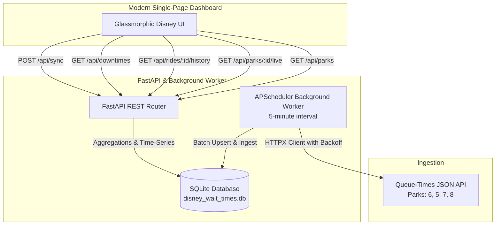

# 🏰 Disney World Wait Times Tracker & Analytics Dashboard

A full-stack real-time Disney World queue tracking application. It ingests live wait times from the Queue-Times API across all 4 theme parks, persists observations into SQLite, and provides an interactive dashboard with time-series curves comparing today's live wait times with historical hourly averages.

---

## Features

- **Automated Data Ingestion**: Background worker polling the Queue-Times API every 5 minutes with resilience, retry backoff, and rate-limit handling.
- **Target Parks**:
  - **Magic Kingdom** (ID: 6)
  - **EPCOT** (ID: 5)
  - **Disney's Hollywood Studios** (ID: 7)
  - **Disney's Animal Kingdom** (ID: 8)
- **Time-Series Persistence**: SQLite schema (`parks`, `lands`, `rides`, `wait_times`) with composite indexing on `(ride_id, timestamp_utc)` for sub-millisecond query aggregations.
- **Time-Series Comparison Chart**: Interactive Chart.js visualization comparing today's real-time queue curve (solid glowing cyan) against historical hourly averages (dashed amber baseline).
- **Downtime Intelligence**: Real-time tracking of attraction downtimes with estimated duration and park breakdown.
- **Search & Filter Directory**: Instant search across 100+ attractions by name, land, park, and operating status.
- **Live On-Demand Sync**: Header action button to trigger an immediate resort-wide poll without waiting for the 5-minute cycle.

---

## Architecture & Tech Stack



---

## Database Schema

```sql
-- Parks Table
CREATE TABLE parks (
    id INTEGER PRIMARY KEY,
    name TEXT NOT NULL
);

-- Lands Table
CREATE TABLE lands (
    id INTEGER PRIMARY KEY,
    park_id INTEGER NOT NULL REFERENCES parks(id) ON DELETE CASCADE,
    name TEXT NOT NULL
);

-- Rides Table
CREATE TABLE rides (
    id INTEGER PRIMARY KEY,
    land_id INTEGER REFERENCES lands(id) ON DELETE SET NULL,
    park_id INTEGER NOT NULL REFERENCES parks(id) ON DELETE CASCADE,
    name TEXT NOT NULL
);

-- Time-Series Wait Times
CREATE TABLE wait_times (
    id INTEGER PRIMARY KEY AUTOINCREMENT,
    ride_id INTEGER NOT NULL REFERENCES rides(id) ON DELETE CASCADE,
    timestamp_utc TEXT NOT NULL,
    wait_time_minutes INTEGER NOT NULL,
    is_open BOOLEAN NOT NULL
);

-- Indices for rapid time-series analysis
CREATE UNIQUE INDEX idx_unique_ride_timestamp ON wait_times (ride_id, timestamp_utc);
CREATE INDEX idx_wait_times_ride_timestamp ON wait_times (ride_id, timestamp_utc);
CREATE INDEX idx_wait_times_timestamp ON wait_times (timestamp_utc);
CREATE INDEX idx_rides_park ON rides (park_id);
```

---

## REST API Endpoints

| Method | Endpoint | Description |
|---|---|---|
| `GET` | `/api/health` | Service health status |
| `GET` | `/api/parks` | Overview statistics for all 4 parks (avg wait, open/down counts, highest wait ride) |
| `GET` | `/api/parks/{park_id}/live` | Detailed live wait times for a park, grouped by lands and attractions |
| `GET` | `/api/rides` | Searchable/filterable list of all attractions (`park_id`, `search`, `open_only`) |
| `GET` | `/api/rides/{ride_id}/history` | Time-series data: today's recorded curve + historical hourly rolling averages |
| `GET` | `/api/downtimes` | Currently closed attractions with estimated downtime duration |
| `POST` | `/api/sync` | Trigger an immediate live sync from Queue-Times |

---

## Getting Started

### 1. Requirements
- Python 3.10+ (Tested on Python 3.14)
- Pip

### 2. Install Dependencies
```bash
pip install -r requirements.txt
```

### 3. Run the Application
```bash
python run.py
```
Open your browser and navigate to:
```
http://127.0.0.1:8000
```

### 4. Run Automated Tests
```bash
python -m unittest discover -s tests -v
```
